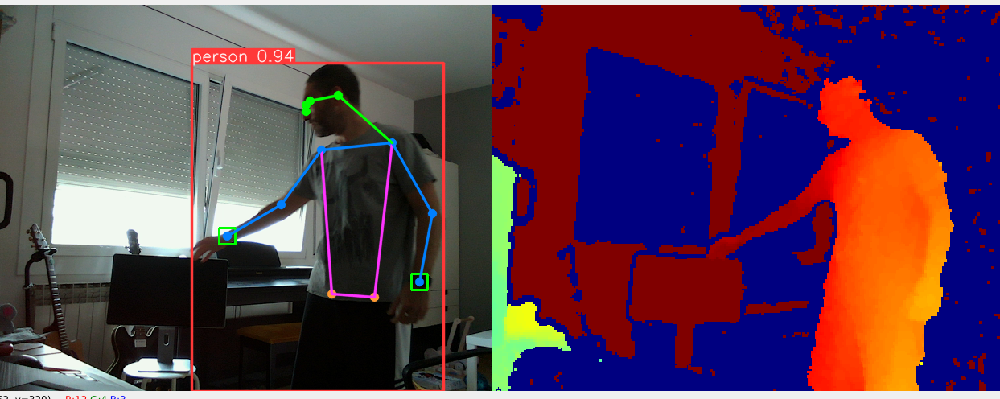
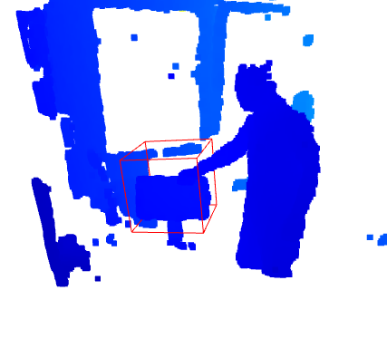

# Hand Detection and Pose Estimation Using RealSense, YOLOv8, and Open3D

This project uses Intel's RealSense camera to capture depth and color frames, YOLOv8 for hand pose estimation, and Open3D to process and visualize the point cloud data. The system continuously monitors for hands and generates warnings if detected hands come into a predefined 3D restricted area.

### Example of detection in the warning area:



### Example of 3D plot when a hand enters in the restricted area:




## Installation

This project is based on Python and requires the following dependencies:

- `pyrealsense2`
- `open3d`
- `numpy`
- `cv2`
- `ultralytics` YOLO

Use pip to install these dependencies:

```bash
pip install pyrealsense2 open3d numpy opencv-python-headless ultralytics
```

The ultralytics package also requires the YOLOv8 model. You can download it using:

```bash
wget https://github.com/ultralytics/yolov8/releases/download/v1.0/yolov8n-pose.pt
```

## Usage

1. After installing the required dependencies, run the script using the command:

```bash
python main.py
```

2. Once the script is running, it will open a window showing the camera feed. 

3. If a hand enters the predefined 3D restricted area, the system will generate a warning and will visualize the point cloud.

4. Press 'q' or 'esc' to quit the script.

5. Press 's' to save the current color and depth images to the 'images' folder.

6. Press 'c' to capture the current point cloud.

## How it works

The script continuously captures color and depth frames from the RealSense camera, and uses the YOLOv8 model to estimate the hand pose. It checks whether each hand's pose is within a predefined 3D restricted area. If a hand enters this area, the script captures the point cloud and displays it.

The script uses Open3D for point cloud processing and visualization. It calculates the hand pose by taking into account the camera intrinsics and the depth at the hand's pixel coordinates.

## Important Functions

- `get_bounding_box_pose()`: This function takes in the depth frame, the center of the hand, camera intrinsics, and the size of the bounding box. It returns the pose of the hand in world coordinates.

- `get_pose()`: This function gets the pose of a pixel in the image using its depth value and the world coordinates. It returns the pose as a numpy array.

- `process_hand()`: This function processes the hand's pose and draws a rectangle around the hand in the color image. If the hand's pose is within the 3D restricted area, it returns `True`; otherwise, it returns `False`.

- `main()`: This function sets up the RealSense pipeline, loads the YOLOv8 model, and enters a loop where it captures frames, estimates the hand pose, checks whether the hand is in the restricted area, and visualizes the point cloud when necessary.

## Contribution

Contributions are always welcome. Please make sure to update tests as appropriate and follow the code of conduct. 

## License

[MIT](https://choosealicense.com/licenses/mit/)